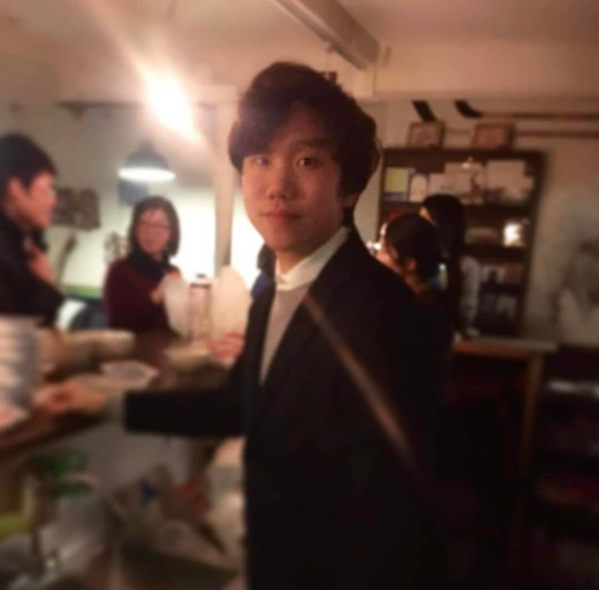
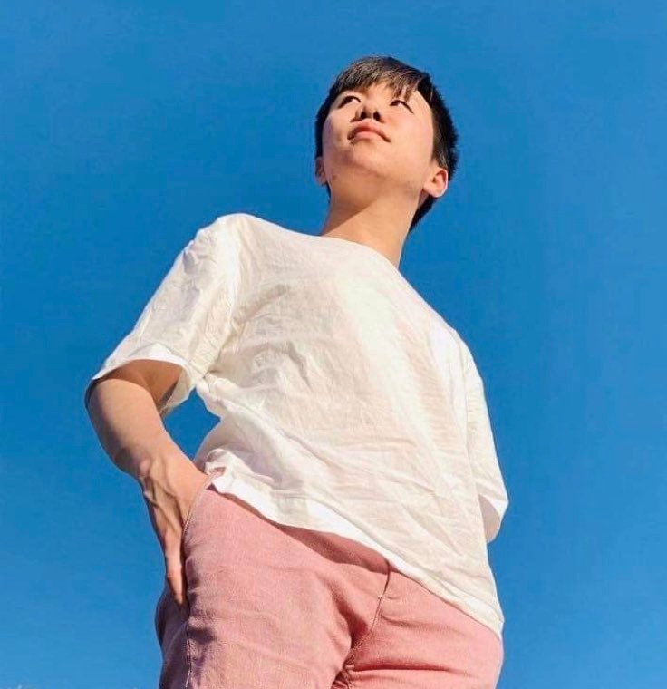

# 🌍 Welcome to My World! 🌎

---

## 👋 Hello, Fellow Explorers!

Thank you for visiting **my blog**! I'm just an ordinary person trying to navigate life in this complicated world full of information. This blog is my journey to **learn**, **understand**, and **grow with you** in a time when it's easy to get lost in the flood of news and information.

---

## 📝 My Messages

> Writing is still a challenging task for me, but through this challenge, I hope to **share with you** the world as I understand it.

In this blog, I aim to discuss:
- 🌐 **Complex news**
- 🌍 **Global issues**
- 📚 **Knowledge sharing**
- 💡 **Insightful discussions**
- 🌱 **Personal growth**

Occasionally, I'll also share:
- 📔 My **diary** entries
- 🎵 **Favorite music**
- ✈️ **Travel stories**
- And much more!

---

## 🙋‍♂️ About Me

| Category | Details |
|:--------:|:--------|
| **Name** | Yechan Jun (CHANCHAN) |
| **Origin** | 🇰🇷 Korea |
| **MBTI** | ENFP (INFP when working) |
| **Studies** | 🎓 International Media, Communication, and Tourism Studies at Hokkaido University |
| **Loves** | 🏙️ Sapporo, 👥 People, 🎶 Music |

---

### 💖 Thank you for joining me on this journey! 💖

[Twitter](https://twitter.com/chanchansapporo) • [Instagram](https://instagram.com/chanchan_please_be_happy)

